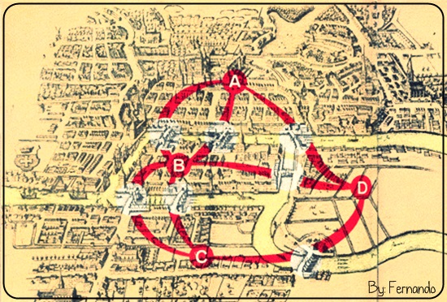

# El problema de los siete puentes de Köningsberg

El Matemático [Leonhard Euler](..\Mencion\Leonhard_Euler.md) invento la teoría de grafos, todo partió por un problema sencillo en la ciudad de Königsberg donde hay siete puentes que conectan una isla.

El problema consistía en encontrar un camino posible en el que una persona no tenga que recorrer dos veces el mismo puente. Euler al tener un pensamiento creativo y crítico encontró la solución representando el mapa como vértices y aristas.

