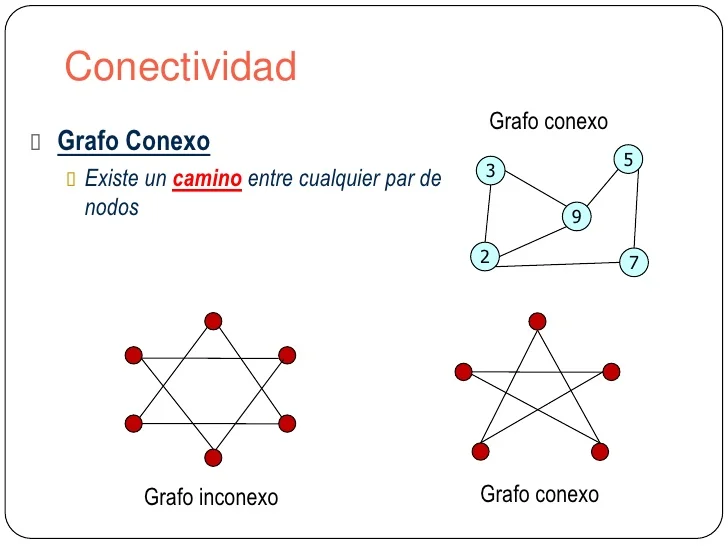
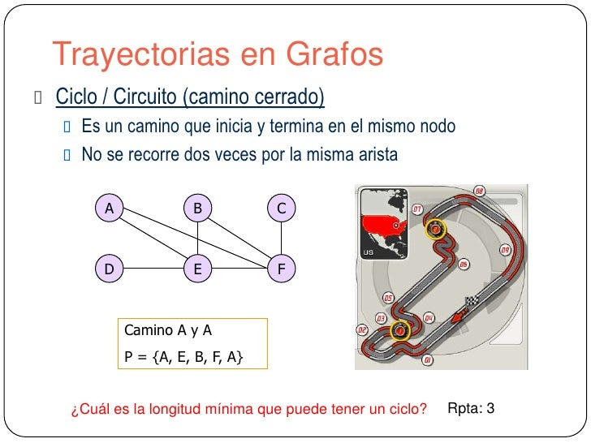

# Grafos

Su primera aplicación fue en [El problema de los siete puentes de Königsberg](Anexos\El_problema_de_los_siete_puentes_de_Königsberg.md) solucionado por el matemático [Leonhard Euler](Mencion\Leonhard_Euler.md).

Un grafo es una estructura de datos que permite representar a los objetos como vértices y aristas. A simple vista se puede pensar que la única utilidad de un grafo es estética, pero su versatilidad yace en representar de forma abstracta e intuitiva relaciones entre objetos y como se conectan entre sí. Esta herramienta tiene un sin fin de aplicaciones en la [Telecomunicaciones](Anexos\Telecomunicaciones.md), [Ciencia de datos](Anexos\Ciencia_de_datos.md), [Machine Learning](Anexos\Machine_Learning.md) e [Inteligencia artificial](Anexos\Inteligencia_artificial.md).

## Partes de un grafo

- **Nodos**: objetos que pueden tener relación con uno o más objetos.
- **Relaciones**: líneas o aristas que conectar a los objetos y brindan contexto de las conexiones de los objetos.
- **Nodos padre**: nodo central al cual se conecta otros nodos.
- **Nodos hijo**: nodo que hace referencia a uno o más nodos.

## Tipos de grafos

- **No dirigido**: mapa de grafos que no usa flechas, únicamente aristas
- **Dirigido**: mapa de grafos que utiliza flechas para representar que nodos hacen referencia a otros.
- **Ponderado**: a los grafos se les asigna un peso o grado dependiendo del numero de nodos que hace referencia e él. El grado de un nodo puede representar la distancia, gastos, temperatura o cualquier medida relevante.
- **Conexo**: es cuando se puede llegar a otro nodo recorriendo una ruta (existe conectividad entre todos los nodos)
  
- **Acíclico**: no existe un camino cerrado en un grafo.
- **Completo**: la ruta en un grafo es cerrada y no se repite dos veces la misma arista.
  

## Terminología de grafos

- **Ciclo**: ruta en un mapa de nodos en el que no se repite más de una vez un nodo, a excepción del nodo inicial.
- **Grado de un nodo**: Numero de aristas, referencias o conexiones que tiene un nodo.
- **Camino**: Un ruta en un mapa de nodos

## Proximamente...

- Cómo aplicar los grafos en programación
- Cómo hacer [Backtracking](Algoritmos\Backtracking.md)
- Cómo crear y usar el [Algoritmo Dijkstra](Algoritmos\Dijkstra.md)
- Cómo crear y usar el algoritmo [A\*](Algoritmos\A✳️.md)
- Cómo aplicar grafos en mapas.

### [Bibliografía](Bibliografía\Bibliografía.md)
